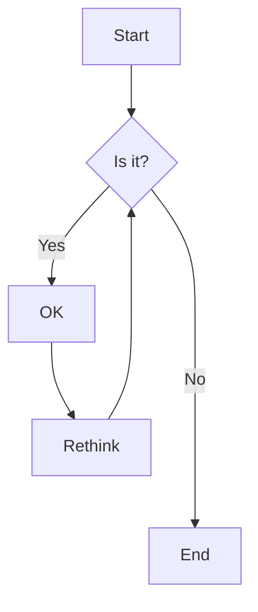

# Section Slide

## Title Content Slide
some content

## Title Image Slide ::toc:false

## Title Image Slide to test image description & credit ::toc:false

## Title Image Slide to test image credit ::toc:false

## Title Image Slide to test image credit without value::toc:false

## Title Image Slide to test invalid image metadata ::toc:false

## Title Content Image Slide ::slide:title-content-image
some content

## Title Content Image Slide - scale down font ::slide:title-content-image

**this line should be visible**

- Lorem
- ipsum
- dolor
- sit
- amet
- consectetur
- adipisicing
- elit
- sed
- eiusmod
- tempor
- incidunt
- ut
- labore
- et
- dolore
- magna
- aliqua.
- Ut
- enim
- ad
- minim
- veniam

Lorem ipsum dolor sit amet, consectetur adipisicing elit, sed eiusmod tempor incidunt ut labore et dolore magna aliqua. Ut enim ad minim veniam, quis nostrud exercitation ullamco laboris nisi ut aliquid ex ea commodi consequat. Quis aute iure reprehenderit in voluptate velit esse cillum dolore eu fugiat nulla pariatur. Excepteur sint obcaecat cupiditat non proident, sunt in culpa qui officia deserunt mollit anim id est laborum.

**this line should be visible**

## ::slide:image ::background:test-16-9.png ::pdfbackground:test-4-3.png

This is some content.

## ::slide:image
some content

# Section Slide for long TOC
# Section Slide for long TOC
# Section Slide for long TOC
# Section Slide for long TOC
# Section Slide for long TOC
# Section Slide for long TOC
# Section Slide for long TOC
# Section Slide for long TOC
# Section Slide for long TOC
# Section Slide for long TOC
# Section Slide for long TOC
# Section Slide for long TOC
# Section Slide for long TOC
# Section Slide for long TOC
# Section Slide for long TOC
# Section Slide for long TOC
# Section Slide for long TOC
# Section Slide for long TOC
# Section Slide for long TOC
# Section Slide for long TOC

## Mermaid JS

